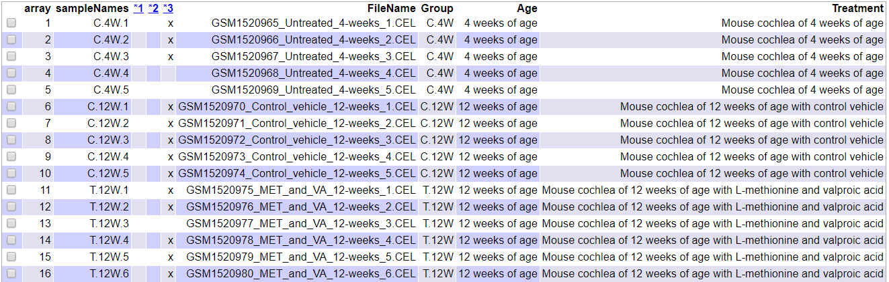
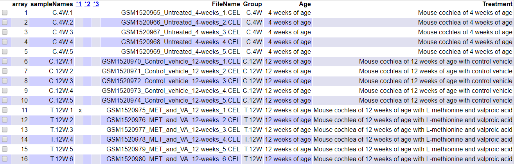

```{r, results='asis', echo=FALSE}
cat("\\newpage")
```


# 1 Resumen/Abstract

El análisis de microarrays es un proceso que auna la bioestadística y la bioinformática para permitirnos encontrar diferencias en la expresión génica de algunos genes. En esta PEC utilizaremos los datos de microarray crudos (.CEL) del Gene Expression Omnibus (GEO ID: GSE62173) con la intención de reanalizarlos y así identificar genes involucrados en la pérdida progresiva de audición.
Estos datos provienen de muestras de cóclea de ratones *DBA/2J* (modelo animal de pérdida de audición) con y sin tratamiento con agentes modificadores de la epigenética (L-metionina (MET) y Ácido valproico (VPA)).

# 2 Objetivos

Entre los objetivos principales de este ejercicio encontramos:

* Re-analizar microarrays de expresión génica de mRNA de ratones *DBA/2J* (modelo animal de pérdida de audición progresiva). Se trata de un estudio del tipo comparación de grupos o *class comparison*, en el que se pretende determinar si los perfiles de expresión génica de las cócleas difieren entre los grupos de ratones tratados (MET y VPA) y no tratados, y así identificar los genes involucrados en la pérdida auditiva.
* Llevar a cabo un workflow teniendo como material de partida los datos crudos del estudio de microarrays de Affymatrix (archivos .CEL), que siga los siguientes pasos: Lectura de archivos, conctrol de calidad, normalización, fitlrado, selección de genes diferencialmente expresados (DEG), comparación de las listas seleccionadas y análisis  de significación biológica.
* Redactar un informe exponiendo los resultados obtenidos.

# 3. Materiales

En esta sección enunciaremos todos los materiales necesarios para realizar un análisis de microarrays, tanto programas utilizados como los datos usados.

## 3.1 Software

El programa para realizar todos los cálculos y funciones de forma automatizada de este análisis es el **programa de análisis estadístico R**. Este programa puede conseguirse a través de su página web (https://www.r-project.org/) en el apartado *download R*. El análisis mostrado en esta PEC se ha llevado a cabo en la versión 3.6.3 (2020-02-29).

R tiene entorno para estadística computacional y gráfica basado en una consola de comandos. Su uso puede simplificarse con la interfaz **R-Studio**, que le proporciona al programa un sistema de organización por ventanas, haciendo así más amigable la navegación a través de las distintas opciones disponibles. R-Studio es una herramienta que se ha utilizado en la creación de este informe, aunque no es esencial para la reproducibilidad de éste, y puede descargarse desde su web (https://rstudio.com/).

Muchas de las funciones utilizas en este informe no pertenecen a la librería base de R, sino que se descargan a través de paquetes que han sido desarrollados por la comunidad de usuarios. Algunas de estas librerías han sido específicamente diseñadas para el análisis de microarrays, como por ejemplo las librerías del proyecto **Bioconductor**, de código abierto y libre. Bioconductor es la herramienta elegida por muchos bioestadísticos y bioinformáticos por su comodidad y flexibilidad, dado que permite la automatización  de tareas repetitivas a través de *scripts*.

Entre los paquetes instalados y cargados en este informe encontramos:

* ```BiocManager```
* ```knitr```
* ```colorspace```
* ```gplots```
* ```ggplot2```
* ```ggrepel```
* ```htmlTable```
* ```prettydoc```
* ```devtools```

Y dentro de BiocManager:

* ```oligo```
* ```pd.mogene.2.1.st```
* ```arrayQualityMetrics```
* ```pvca```
* ```limma```
* ```genefilter```
* ```mouse4302.db```
* ```annotate```
* ```org.Mm.eg.db```
* ```clusterProfiler````
* ```Biobase```

## 3.2 Datos

Los datos a re-analizar están publicados en el estudio Miya et al. (2015) y pueden obtenerse desde la base de datos pública Gene Expression Omnibus (GEO), un repositorio que distribuye gratuitamente datasets relacionados con estudios de expresión génica y otras funciones genómicas. La base de datos elegida se identifica mediante el número de acceso: **GSE62173**.

Los datos de partida utilizados en este análisis son datos crudos, con extensión .CEL. El estudio del cual se generaron los datos de es del tipo comparación de grupos o *class comparison*, en el que se pretende determinar si los perfiles de expresión génica de las cócleas difieren entre los grupos de ratones tratados y no tratados, y así identificar los genes involucrados en la pérdida auditiva. El estudio se realizó con microarrays de la marca Affymetrix (GeneChip Mouse Genome 430 2.0 Array). El número total de muestras del estudio es de 16 y encontramos 3 grupos distintos:

* Grupo de ratones *DBA/2J* machos de 4 semanas no tratados, que se utilizaron como controles jóvenes. (n = 5)

* Grupo de ratones *DBA/2J* machos tratados desde la semana 4 con reactivos modificadores epigenéticos mediante inyección subcutánea diaria durante 8 semanas (500 mg/kg/día MET + 300 mg/kg/día VPA en 10 ml/kg de Bicarbonato de Sodio 0.1 M) (n = 6).(MET + VPA)

* Grupo de ratones *DBA/2J* machos control. Se realizó una inyección subcutánea a este grupo desde la semana 4 durante 8 semanas con solo vehículo (Bicarbonato de Sodio 0.1 M) (n = 5).


# 3 Métodos o *Pipeline* del análisis

## 3.1 Preparación del entorno de trabajo

Dado que vamos a trabajar con varios archivos de datos, tanto los datos crudos (CEL files) y los datos generados a lo largo de todo el protocolo de análisis, es recomendable crear algunas carpetas antes de empezar el análisis:

* Una carpeta principal que será nuestro directorio de trabajo llamada, por ejemplo, "PEC1".
* Una carpeta llamada, por ejemplo, **datos** localizada dentro del directorio de trabajo. Aquí guardarems todos los archivos tipo .CEL.
* Una carpeta llamada, por ejemplo, **resultados** localizada dentro del directorio de trabajo principal en la que enviaremos y guardaremos todos los resultados de nuestro análisis.

Estos pasos los podemos realizar dentro de la consola de comandos de R o mediante el explorador de archivos de windows. El código y los datos para realizar la acción desde R se puede encontrar en el **Apéndice** y en el repositorio de **Github**: https://github.com/crmnlc/ADO_PEC1.

```{r echo=FALSE, warning=FALSE}
#Creación de entorno de trabajo y preparación de carpetas utilizadas para el análisis

setwd("D:/Users/Carmen/Desktop/Carmen/Curso_2019-2020/Master_bioinformatica_bioestadistica/ADO/PEC 1/PEC1")
dir.create("datos")
dir.create("resultados")
```


## 3.2 Preparación de los datos para el análisis

Los datos para el análisis serán de dos tipos, los **CEL files** y el **target files**.

Los archivos CEL contienen los datos crudos obtenidos del escaneado de los microarrays y su preprocesado con programas de Affymetrix (Ver apartado 3.2.1). Estos archivos pueden descargarse desde GEO buscando nuestro estudio con el número de acceso facilitado anteriormente, y deberán guardarse en la carpeta **datos**. Lo normal es tener un archivo tipo CEL distinto para cada muestra. En nuestro caso tenemos 16 archivos distintos:

1. ```GSM1520965_Untreated_4-weeks_1.CEL```
2. ```GSM1520966_Untreated_4-weeks_2.CEL```
3. ```GSM1520967_Untreated_4-weeks_3.CEL```
4. ```GSM1520968_Untreated_4-weeks_4.CEL```
5. ```GSM1520969_Untreated_4-weeks_5.CEL```
6. ```GSM1520970_Control_vehicle_12-weeks_1.CEL```
7. ```GSM1520971_Control_vehicle_12-weeks_2.CEL```
8. ```GSM1520972_Control_vehicle_12-weeks_3.CEL```
9. ```GSM1520973_Control_vehicle_12-weeks_4.CEL```
10. ```GSM1520974_Control_vehicle_12-weeks_5.CEL```
11. ```GSM1520975_MET_and_VA_12-weeks_1.CEL```
12. ```GSM1520976_MET_and_VA_12-weeks_2.CEL```
13. ```GSM1520977_MET_and_VA_12-weeks_3.CEL```
14. ```GSM1520978_MET_and_VA_12-weeks_4.CEL```
15. ```GSM1520979_MET_and_VA_12-weeks_5.CEL```
16. ```GSM1520980_MET_and_VA_12-weeks_6.CEL```

Otro archivo que necesitamos es el archivo **targets**, que contiene la información de los grupos, genotipos, tratamiento y demás información importante para poder identificar las muestras (*Table 1*). Este archivo relaciona el nombre de los archivos .CEL con cada una de las condiciones o grupos del experimento. En este archivo también podemos añadir columnas con etiquetas de los grupos para facilitar y a cortar la nomenclatura de cada archivo.Por ejemplo:

* Columna llamada *NombreArchivo*. Contiene el nombre exacto del archivo .CEL de la carpeta **datos**.
* Columna llamada *Grupo*. Resume las condiciones del experimento para esa muestra en concreto.
* Columna llamada *NombreCorto*. Se utilizará para guardar una etiqueta para la muestra, esto puede servirnos a la hora de realizar representaciones gráficas.
* Otro tipo de columnas que almacene datos sobre esas muestras como por ejemplo: edad, sexo, cepa, tejido, tratamiento y GEO_Accesion.

Muchos de estos datos adicionales de las muestras los podemos encontrar en el objeto **ExpressionSet** en el apartado de ```PhenoData```. La clase **ExpressionSet** está diseñada para combinar varios tipos de información en una única estructura. Estos objetos pueden manipularse convenientemente (realizando subsets, por ejemplo, de manera parecida a como se haría con un Dataframe de R).Los datos **ExpressionSet** coordinan varios tipos de datos (datos de los microarrays, características, protocolo...) para que sea más sencilla su manipulación. Aunque la creación de estas estructuras puede resultar complicada, con la función ```getGEO``` se descarga el archivo de manera mucho más sencilla.En el apéndice podemos ver cómo descargar este archivo desde GEO y navegar a través de él para obtener la información requerida para construir nuestro archivo **targets**. Tras su creación, exportaremos este archivo como un archivo de extensión .csv y lo guardaremos dentro de la carpeta principal "PEC1".

```{r echo=FALSE, message=FALSE, warning=FALSE}
# Descarga del objeto ExpressionSet
if(!require(Biobase)){ BiocManager::install("Biobase") }; library(Biobase)
if(!require(GEOquery)){ BiocManager::install("GEOquery") }; library(GEOquery)
# other packages
if(!require(dplyr)) { install.packages("dplyr") }; library(dplyr)
if(!require(magrittr)) { install.packages("magrittr") }; library(magrittr)
if(!require(kableExtra)) { install.packages("kableExtra") }; library(kableExtra)
if(!require(tinytex)){ install.packages('tinytex') & tinytex::install_tinytex() }; library(tinytex)
gse <- getGEO("GSE62173")

```


```{r echo=FALSE, message=FALSE, warning=FALSE}
# Creación del archivo Targets
esetFromGEO <- gse[[1]]
s1 <- list()
s1[[1]] <- list.files(paste(getwd(), "datos", sep= "/"), pattern=NULL, all.files=FALSE,full.names=FALSE)
s1[[2]] <- c(rep(c('C.4W', 'C.12W'), each = 5), rep('T.12W', 6))
s1[[3]] <- pData(esetFromGEO)[[40]]
s1[[4]] <- pData(esetFromGEO)[[41]]
s1[[5]] <- pData(esetFromGEO)[[42]]
s1[[6]] <- pData(esetFromGEO)[[43]]
s1[[7]] <- as.character(pData(esetFromGEO)[[1]])
s1[[8]] <- pData(esetFromGEO)[[2]]
s1[[9]] <- paste(s1[[2]], c(1:5,1:5,1:6), sep = ".")
targets <- as.data.frame(s1, stringsAsFactors=FALSE)
names(targets) <- c('FileName','Group','Age', 'Sex', 'Strain', 'Tissue', 'Treatment', 'GEO_Accesion', 'ShortName')
```

```{r echo=FALSE, message=FALSE, warning=FALSE}
tab <- knitr::kable(targets, booktabs = TRUE, caption = 'Contenido del archivo targets utilizado para este análisis')
tab %>% kable_styling(latex_options = c("scale_down", "striped"))
```

```{r echo=FALSE, message=FALSE, warning=FALSE}
write.csv2(targets, paste(getwd(), "targets.csv", sep= "/"), row.names = TRUE, quote = FALSE)
```


### 3.2.1 Generación de los archivos .CEL

Se extrajo el RNA total de la cóclea izquierda de los ratones con TRIzol y se purificó con el mini kit RNeasy. La calidad del RNA se midió utilizando un Bioalanalyzer y se utilizaron en el estudio solo las muestras que tuviesen un RNA Integrity Number (RIN) superior a 7.

En cuanto al proceso de hibridación se biotinizaron las muestras (aRNA) y se hibridaron 10 $\mu g$ de aRNA durante 16 h a 45$^\circ$C en el array GeneChip Mouse Genome 430 2.0 Array (Affymetrix) con 45.101 sondas. Los arrays se lavaron y tiñieron usando la estación fluídica de Arrays 450 (Affymetrix) para luego ser escaneados con el escaner de Arrays GeneChip Scanner 3000 7G System (Affymetrix) y finalmente las imagenes se digitalizaron y se exportaron a archivos .CEL con el Software de manipulación de GeneChip (GCOS) (Miya et al. (2015)).

## 3.3 Intalación de paquetes en R

Los paquetes que no se encuentren en la librería básica de R deberán ser instalados y cargados antes de proceder al análisis de los datos.

En el apartado de **Materiales** tenemos una lista de los paquetes utilizados para el estudio, la mayoría de los cuales se descargan desde *Comprehensive R Archive Network* (CRAN) o Bioconductor cuando se trate de paquetes de este proyecto en concreto.

Para instalar los paquetes estándar de R necesitaremos la función ```install.packages()```. Por otro lado, la función varía un poco cuando se trata de instalaciones de paquetes dentro del proyecto Bioconductor, siendo el código así: ```BiocManager::install()```. La instalación y carga de los paquetes se tiene que realizar una única vez a lo largo de todo el análisis.

El código necesario para la carga de los paquetes se puede observar en el **Apéndice**. Algunos de los paquetes instalados necesitan compilarse, por lo que es importante instalar **Rtools**.

```{r eval=TRUE, message=FALSE, warning=FALSE, include=FALSE}
#Instalación de los paquetes básicos del proyecto Bioconductor
if (!requireNamespace("BiocManager", quietly = TRUE))
install.packages("BiocManager")
BiocManager::install(version = "3.10")
```

```{r eval=FALSE, message=FALSE, warning=FALSE, include=FALSE}
# Instalación del resto de paquetes necesarios para el análisis
install.packages("knitr")
install.packages("colorspace")
install.packages("gplots")
install.packages("ggplot2")
install.packages("ggrepel")
install.packages("htmlTable")
install.packages("prettydoc")
install.packages("devtools")
install.packages("BiocManager")
install.packages("dplyr")
install.packages("magrittr")
BiocManager::install("oligo")
BiocManager::install("pd.mogene.2.1.st")
BiocManager::install("arrayQualityMetrics")
BiocManager::install("pvca")
BiocManager::install("limma")
BiocManager::install("genefilter")
BiocManager::install("mouse4302.db")
BiocManager::install("annotate")
BiocManager::install("org.Mm.eg.db")
BiocManager::install("clusterProfiler")
BiocManager::install("Biobase")
BiocManager::install("GEOquery")
```

## 3.4 Lectura de los archivos .CEL

En este apartado leeremos los datos crudos (archivos CEL) y los guardaremos en una variable que llamaremos **rawData**. Para lo que necesitaremos cargar el paquete *oligo* mediante la función ```library()``` de R, en el que encontraremos las funciones necesarias para la lectura de este tipo de archivos. El código utilizado para leer estos archivos se encuentra en el **Apéndice**. Es importante tener en cuenta que uno de los argumentos de la función para la lectura de los archivos CEL es la ruta de acceso a los archivos, es decir, nuestra carpeta **datos**.

También volveremos a cargar el archivo **targets**, pero esta vez utilizando la función ```read.AnnotatedDataFrame()```, guardaremos el archivo resultante en la variable ```my.files```. Esto se hace para asociar la información que se encuentra en los archivos .CEL con el archivo **targets**, creando así un *ExpressionSet* (como el que habiamos visto anteriormente, pero ahora creado por nosotros). Así, podremos cambiar el nombre largo de las muestras por el corto de la columa *ShortName* del archivo **targets**.

```{r eval=TRUE, message=FALSE, warning=FALSE, include=FALSE}
#Lectura de archivos .CEL
library(oligo)
celFiles <- list.celfiles("./datos", full.names = TRUE)
library(Biobase)
my.targets <-read.AnnotatedDataFrame(file.path(".", "targets.csv"), 
                                     header = TRUE, row.names = 1, fill = TRUE, stringsAsFactors = FALSE, colClasses = c("character"), 
                                     sep=";") 
# Subsanación de problemas de variables de 
my.targets[[8]] <- pData(esetFromGEO)[[2]]
my.targets[[9]] <- paste(s1[[2]], c(1:5,1:5,1:6), sep = ".")
rawData <- read.celfiles(celFiles, phenoData = my.targets)
```

```{r eval=TRUE, message=FALSE, warning=FALSE, include=FALSE}
# Cambio de nombre
my.targets@data$ShortName->rownames(pData(rawData))
colnames(rawData) <-rownames(pData(rawData)) 
```

```{r}
head(rawData)
```

## 3.5 Control de Calidad de los datos crudos

Una vez que ya tenemos cargados todos los datos crudos en nuestra sesión de R, debemos revisar si tienen la suficiente calidad como para normalizarlos. Esto es muy importate porque si los datos fuesen de mala calidad añadirían mucho ruido al análisis, y a pesar de normalizar los datos no se podría solventar el problema. El paquete ```ArrayQualityMetrics``` se utiliza para realizar todos estos controles de calidad, como por ejemplo, un gráfico de cajas y bigotes de la intensidad o un *Análisis de componentes principales (PCA)*, antes que nada cargaremos esta librería para poder utilizar la función. Si alguno de los arrays tiene datos de intensidad que se encuentran por encima de un umbral establecido por el control de calidad, estos datos se marcan con un asterisco como valores atípicos.

Si se encuentran más de tres valores atípicos en un array debería de revisarse, dado que probablemente sea necesario rechazar esta muestra para mejorar la calidad del experimento y, por tanto, del análisis. Hay que cambiar la carpeta que tenemos en R como directorio de trabajo a nuestra carpeta de **resultados** para que se nos guarden los archivos generados en ella. En el **Apéndice** podemos ver el código utilizado en esta parte.

```{r eval=TRUE, message=FALSE, warning=FALSE, include=FALSE}
# Cambio de wd y carga de librería
setwd("D:/Users/Carmen/Desktop/Carmen/Curso_2019-2020/Master_bioinformatica_bioestadistica/ADO/PEC 1/PEC1/resultados")
library(arrayQualityMetrics)
```

```{r eval=FALSE, message=FALSE, warning=FALSE, include=FALSE}
arrayQualityMetrics(rawData)
```

```{r eval=TRUE, message=FALSE, warning=FALSE, include=FALSE}
setwd("D:/Users/Carmen/Desktop/Carmen/Curso_2019-2020/Master_bioinformatica_bioestadistica/ADO/PEC 1/PEC1")
```

Desde el entorno de Windows podemos, podemos verificar los archivos obtenidos tras ejecutar la función. Encontramos ahora dentro de la carpeta **resultados** una carpeta llamada **arrayQualityMetrics report for rawData**. Dentro de esta nueva carpeta buscamos un archivo llamado ```index.html```, este archivo nos redirigirá a una página web desde la que podemos ver un resumen del análisis. En la imagen mostrada (*Fig. 1*) observamos la tabla que aparece en el archivo ```index.html```, en el encabezado se pueden apreciar tres columnas con números, que se refieren al método de control de calidad realizado *(1. Detección de valores atípicos por distancias entre arrays, 2. Detección de valores atípicos por gráficas de cajas y bigotes o 3.Detección de valores atípicos mediante MA plots)*. En este caso vemos que 13 muestras han sido marcadas en la columna número 3. Normalmente si las muestras solo están marcadas en una de las columnas los problemas detectados son bastante pequeños y se puede continuar con el análisis.

```{r out.width = "450px", fig.cap="Aspecto de la tabla resumen del index.html file, generado por el paquete arrayQualityMetrics sobre los datos crudos", echo=FALSE}

```


Se puede llevar a cabo un análisis de componentes principales (PCA) diseñando una función específica para ello con ```function()``` y puede visualizarse en *Fig. 2*. El código para esta función se muestra en el **Apéndice**.


```{r eval=TRUE, message=FALSE, warning=FALSE, include=FALSE}
library(ggplot2)
library(ggrepel)
plotPCA3 <- function (datos, labels, factor, title, scale,colores, size = 1.5, glineas = 0.25) {
  data <- prcomp(t(datos),scale=scale)
  # plot adjustments
  dataDf <- data.frame(data$x)
  Group <- factor
  loads <- round(data$sdev^2/sum(data$sdev^2)*100,1)
  # main plot
  p1 <- ggplot(dataDf,aes(x=PC1, y=PC2)) +
    theme_classic() +
    geom_hline(yintercept = 0, color = "gray70") +
    geom_vline(xintercept = 0, color = "gray70") +
    geom_point(aes(color = Group), alpha = 0.55, size = 3) +
    coord_cartesian(xlim = c(min(data$x[,1])-5,max(data$x[,1])+5)) +
    scale_fill_discrete(name = "Group")
  # avoiding labels superposition
  p1 + geom_text_repel(aes(y = PC2 + 0.25, label = labels),segment.size = 0.25, size = size) + 
    labs(x = c(paste("PC1",loads[1],"%")),y=c(paste("PC2",loads[2],"%"))) +  
    ggtitle(paste("Ánalisis de componente principal (PCA) de: ",title,sep=" "))+ 
    theme(plot.title = element_text(hjust = 0.5)) +
    scale_color_manual(values=colores)
  }
```

```{r echo=FALSE, message=FALSE, fig.cap="Gráfica de las dos componentes principales para los datos crudos", out.width = "400px"}
# Generación gráfico PCA para los datos crudos
plotPCA3(exprs(rawData), labels = targets$ShortName, factor = targets$Group, 
         title="Datos crudos", scale = FALSE, size = 2, 
         colores = c("red", "blue", "green"))
```


```{r echo=FALSE, results='hide'}
#Creación de imagen tipo .tiff del gráfico de PCA de los datos crudos
tiff("figures/PCA_RawData.tiff", res = 200, width = 4.5, height = 4, units = 'in')
plotPCA3(exprs(rawData), labels = targets$ShortName, factor = targets$Group, 
         title="Datos crudos", scale = FALSE, size = 3, 
         colores = c("red", "blue", "green"))
dev.off()
```

Hemos añadido algunos argumentos a la función que nos permite la visualización de la gráfica para que sea más simple su interpretación, como por ejemplo:

* Las etiquetas de los puntos de datos se corresponden a las muestras, que están codificadas en la columna *ShortName* del archivo **targets**
* Los distintos colores nos muestran la diferencias entre los grupos, codificados en la columna *Groups* del archivo **targets**.

La primera componente contribuye al 63.4% de la variabilidad total de la muestra. Tal y como podemos apreciar en la gráfica, parece que el *Tratamiento* es la condición que más influye en la variabilidad dado que las muestras del grupo de tratamiento (verdes) en la zon superior.

También podemos observar la distribución de la intensidad de los arrays utilizando gráficas de cajas y bigotes (*Fig. 3*).

```{r message=FALSE, fig.cap="Boxplot de las intensidades de los arrays (Datos crudos)", out.width = "400px", echo=FALSE}
# Generación gráfica de cajas y bigotes para los datos crudos
boxplot(rawData, cex.axis=0.5, las=2,  which="all", 
         col = c(rep("red", 5), rep("blue", 5), rep("green", 6)),
         main="Distribución de los datos crudos de intensidades: Datos crudos")
```

```{r echo=FALSE, results='hide'}
#Creación de imagen tipo .tiff del gráfico Boxplot de los datos crudos
tiff("figures/Intensity_RawData.tiff", res = 200, width = 4, height = 4, units = 'in')
boxplot(rawData, cex.axis=0.5, las=2,  which="all", 
         col = c(rep("red", 5), rep("blue", 5), rep("green", 6)),
         main="Distribución de los datos crudos de intensidades")
dev.off()
```

Se aprecian diferencias muy pequeñas entre los arrays, pero esto es normal cuando se trata de datos crudos.

## 3.6 Normalización de los datos

Previamente al análisis de expresión diferencial de genes es necesario llevar a cabo una normalización de los datos crudos para que los valores de cada array sean comparables entre sí. Esta normalización pretende eliminar o reducir al máximo las diferencias debidas a variabilidad técnica (por ejemplo, en el proceso de hibridación de las muestras, escaneo de los arrays...). La normalización de los datos consiste en tres pasos: corrección o eliminación del ruido de fondo (*background*), normalización y resumen. El método más común de análisis de microarrays es el *Robust Multichip Analysis* (RMA) (Irizarry et al. (2003)). Utilizaremos la función ```rma()```con este propósito y guardaremos el resultado de la normalización en un archivo llamado **```eset_rma```**.

```{r eval=TRUE, message=FALSE, warning=FALSE, include=FALSE}
# Función para la normalización de datos mediante el método RMA
eset_rma <- rma(rawData)
```

## 3.7 Control de calidad de los datos normalizados

Tras realizar la normalización de los datos es interesante volver a comprobar la calidad de éstos. El proceso a seguir es el mismo que en el paso **3.5 Control de Calidad de los datos crudos**, pero en este caso utilizaremos como *input* el archivo ```eset_rma``` en vez del archivo ```rawData```.

```{r message=FALSE, warning=FALSE, eval=TRUE}
# Evaluación de calidad de los datos normalizados
arrayQualityMetrics(eset_rma, outdir = file.path("./resultados", "QCDir.Norm"), force=TRUE)
```

Al igual que en el paso anterior se nos ha creado una carpeta en nuestro directorio **resultados** llamada ```QCDir.Norm````, en la que volvemos a encontrar un archivo llamado ```index.html```, que nos redirigirá a una página web y nos mostrará una tabla resumen con los arrays marcados según su calidad comprobada a través de tres métodos (*Fig. 4*)

```{r out.width = "450px", fig.cap="Aspecto de la tabla resumen del index.html file, generado por el paquete arrayQualityMetrics sobre los datos normalizados", echo=FALSE}

```

Vemos que ha habido un incremento en la calidad general de los datos al normalizarlos, dado que solo la primera muestra del grupo de los tratados tiene una marca, en comparación a las 13 muestras que estaban marcadas en los datos crudos.

La *Fig. 5* muestra la gráfica de los componentes principales sobre los datos normalizados.

```{r echo=FALSE, message=FALSE, fig.cap="Gráfica de las dos componentes principales para los datos normalizados", out.width = "400px"}
# Generación gráfico PCA para los datos normalizados
plotPCA3(exprs(eset_rma), labels = targets$ShortName, factor = targets$Group, 
         title="Datos normalizados", scale = FALSE, size = 2, 
         colores = c("red", "blue", "green"))
```


```{r echo=FALSE, results='hide'}
#Creación de imagen tipo .tiff del gráfico de PCA de los datos normalizados
tiff("figures/PCA_NormData.tiff", res = 200, width = 4.5, height = 4, units = 'in')
plotPCA3(exprs(eset_rma), labels = targets$ShortName, factor = targets$Group, 
         title="Datos normalizados", scale = FALSE, size = 3, 
         colores = c("red", "blue", "green"))
dev.off()
```

Ahora la componente contribuye en un 23% a la variabilidad total de la muestra. Vemos una disminución en el porcentaje de variabilidad con respecto al PCA de los datos crudos (De un 63.4% a un 23%). Si nos fijamos las muestras parecen estar distribuídas por el gráfico en grupos. Las muestras azules, que se corresponden con controles de 4 semanas de edad, aparecen en la zona de arriba a la izquierda de la gráfica; las muestras rojas, que se corresponden con controles de 12 semanas de edad, se encuentran situadas en la parte baja-izquierda de la gráfica; finalmente, las muestras verdes, tratadas de 12 semanas de edad no se encuentran distribuídas de manera uniforme. Es importante comentar que la muestra 1 del grupo de tratamiento parece estar aislada siempre (además de que ha sido la única marcada como posible problema tras el análisis de calidad)

Por último, vamos a echar un vistazo a la gráfica de cajas y bigotes de las intensidades de los arrays (*Fig. 6*). Podemos fijarnos en que todas las cajas y bigotes tienen la misma apariencia. Esto es debido a que la normalización ha surtido efecto, es decir, ahora las muestras son más comparables entre sí o tienen valores mucho más similares. Como consecuencia a esto, **los gráficos para todas las muestras tras la normalización son idénticos**.

```{r message=FALSE, fig.cap="Boxplot de las intensidades de los arrays (Datos normalizados)", out.width = "400px", echo=FALSE}
# Generación gráfica de cajas y bigotes para los datos normalizados
boxplot(eset_rma, cex.axis=0.5, las=2,  which="all", 
         col = c(rep("red", 5), rep("blue", 5), rep("green", 6)),
         main="Distribución de los datos crudos de intensidades: Datos Normalizados")
```

```{r echo=FALSE, results='hide'}
#Creación de imagen tipo .tiff del gráfico Boxplot de los datos normalizados
tiff("figures/Intensity_NormData.tiff", res = 200, width = 4, height = 4, units = 'in')
boxplot(eset_rma, cex.axis=0.5, las=2,  which="all", 
         col = c(rep("red", 5), rep("blue", 5), rep("green", 6)),
         main="Distribución de los datos normalizados de intensidades")
dev.off()
```

## 3.8 Filtraje no específico

### 3.8.1 Detección de genes más variables

La selección de genes diferencialmente expresados está afectado de manera muy directa con el número de genes totales a partir de los que realizamos el análisis. Cuanto mayor sea el número de genes, más ajustes de *p-valores* debemos realizar, lo cual puede hacer que cometamos un mayor error.

Si un gen se encuentra diferencialmente expresado se espera que haya diferencias significativas entre grupos, por lo que la varianza general de ese gen en concreto será mayor que los genes que no se expresan de forma diferencial. Representar la variabilidad total de todos los genes es útil para decidir qué genes presentan una variabilidad que no se debe al azar, sino a las distintas condiciones de experimentación.

En la *Fig. 7* se muestra la desviación estándar de todos los genes ordenadas de la menor a la mayor desviación. La gráfica nos dice cuáles son los genes más variables, aquellos que tienen una desviación por encima del  90-95% con respecto a la desviación estándar del resto de genes.

```{r message=FALSE, fig.cap="Valores de la desviación estándar de todas las muestras de todos los genes ordenados de menor a mayor", out.width = "400px", echo=FALSE}
# Generación de gráfica percentiles 90-95% de genes más variables
sds <- apply (exprs(eset_rma), 1, sd) #Calculamos la desviación estándar de la expresión de los genes
sdsO<- sort(sds) #Ordenamos
plot(1:length(sdsO), sdsO, main="Distribución de variabilidad de todos los genes",
     sub="La línea vertical representa los percentiles 90% y 95%",
     xlab="Genes (de menos a más variable)", ylab="Standard deviation")
abline(v=length(sds)*c(0.9,0.95))
```

```{r echo=FALSE, results='hide'}
#Creación de imagen tipo .tiff de gráfica percentiles 90-95% de genes más variables
tiff("figures/SDplot.tiff", res = 150, width = 5, height = 5, units = 'in')
plot(1:length(sdsO), sdsO, main="Distribution of variability for all genes",
     sub="Vertical lines represent 90% and 95% percentiles",
     xlab="Gene index (from least to most variable)", ylab="Standard deviation")
abline(v=length(sds)*c(0.9,0.95))
dev.off()
```

### 3.8.2 Filtrado de genes menos variables

Vamos a quitar de la lista los genes cuya variabilidad pueda ser atribuida simplemente al azar y así reducir el número de test a ejecutar y aumentando la fiabilidad de los resultados finales. Para ello utilizaremos la función ```nsFilter``` del paquete ```genefilter``` de Bioconductor, que nos permitirá quitar genes a partir de un umbral (0.5).

```{r results='hide', message=FALSE}
library(genefilter)
library(mouse4302.db)
annotation(eset_rma) <- "mouse4302.db"
filtered <- nsFilter(eset_rma,
require.entrez = FALSE, remove.dupEntrez = FALSE,
var.filter=TRUE, var.func=IQR, var.cutoff=0.5,
filterByQuantile=TRUE)
```

Tras ejecutar la función, obtendremos los valores filtrados y un resumen de los resultados filtrados. Guardaremos los genes filtrados en la variable ```eset_filtered```. Al principio teníamos 45101 genes y, tras el filtrado, nos hemos quedado con 22518 genes. Esto lo podemos comprobar si accedemos al assayData de los *ExpressionSet* ```eset_rma``` y ```eset_filtered``` respectivamente.

```{r, results='hide', echo=FALSE}
# Exploración de los archivos de los genes que se han eliminado y los que se han mantenido.
names(filtered)
class(filtered$eset)
```

```{r}
# Obtención del número de genes eliminados
print(filtered$filter.log)
# Creación del archivo ese_filtered con los genes filtrados
eset_filtered <-filtered$eset
# Obtención del número de genes del ExpressionSet de datos normalizados y de datos filtrados
nrow(exprs(eset_rma))
nrow(exprs(eset_filtered))
```


### 3.8.3 Guardado de datos normalizados y filtrados

Los datos normalizados son el punto de partida de nuestro análisis, pero es posible que queramos recuperarlos más adelante al igual que los datos filtrados. Es por ello que los guardaremos en archivos de tipo '.csv' y los exportaremos a la carpeta de **resultados**.

```{r results='hide', message=FALSE}
# Exportar archivo .csv con los datos filtrados y normalizados
write.csv(exprs(eset_rma), file="./resultados/normalized.Data.csv")
write.csv(exprs(eset_filtered), file="./resultados/normalized.Filtered.Data.csv")
save(eset_rma, eset_filtered, file="./resultados/normalized.Data.Rda")
```

## 3.9 Identificación de genes diferencialmente expresados

### 3.9.1 Definiendo el montaje experimental: La matriz de diseño

La selección de genes diferencialmente expresados consiste en efectuar test para comparar la expresión entre grupos. Existen muchos métodos y test distintos para comparar grupos como el t-test (test básico de estadística), sin embargo, no parece ser el más apropiado para utilizarlo en el análisis de microarrays. Entre las técnicas específicamente desarrolladas para el análisis de microarrays encontramos los modelos lineales, y esta será la herramienta que utilizaremos en este protocolo. Los modelos lineales están implementados en el paquete ```limma```, que se utiliza para seleccionar los genes diferencialmente expresados.

Si realizamos el abordaje mediante métodos lineales el primer paso es crear una **matriz de diseño**. Una matriz de diseño es una tabla que describe a qué grupo o condición experimental está asignada cada muestra. En esta tabla el número de filas es el número de muestras y el número de columnas es el número de grupos. Encontramos un uno en la columna del grupo al que pertenece la muestra y un cero si no pertenece a ese grupo.

La matriz de diseño puede definirse manualmente o a partir de un factor variable introducido en el archivo *targets*. En este estudio la variable *Groups* es una combinación de dos condiciones experimentales, "C/T" y "4W/12W" que pueden representarse como un factor con 3 niveles, dado que no encontramos un grupo de "T.4W".

```{r results='hide', echo=FALSE}
# Carga del archivo eset_filtered
if (!exists("eset_filtered")) load (file="./results/normalized.Data.Rda")
```

```{r results='hide', echo=FALSE}
# Creación de la matriz de  1 (filtered)
library(limma)
designMat<- model.matrix(~0+Group, pData(eset_filtered))
colnames(designMat) <- c("C.12W", "C.4W", "T.12W")
```

```{r}
# Matriz de diseño 1 (filtered)
print(designMat)
```

### 3.9.2 Definiendo comparaciones con la matriz de contrastes

La **matriz de contrastes** se utiliza para describir comparaciones entre grupos y se trata de una tabla en la que tenemos definidas las comparaciones en cada columna y los grupos en cada fila. Una comparación entre grupos - llamada constraste - se representa con "1" y "-1" cuando se comparan los grupos y el resto con 0.

En este ejemplo queremos comprobar el efecto de tratar a los ratones con MET+VPA (C vs T), su control de crecimiento (4W vs 12W) y las diferencias entre el control joven y el tratado de 12 semanas (4W VS T).

```{r}
# Creación de la matriz de contrastes (filtered)
cont.matrix <- makeContrasts (CvsT.12W = C.12W-T.12W,
                              Wvs12W.C = C.4W-C.12W,
                              TVSC =  C.4W - T.12W,
                              levels=designMat)
print(cont.matrix)
```

La matriz de constrastes está definida para realizar tres comparaciones: Efecto del T en los ratones de 12 semanas, Efecto del envejecimiento en los ratones control, Diferencias entre control de 4 semanas con el tratado a las 12 semanas.


### 3.9.3 Estimación del modelo y selección de genes

Una vez que se han definido las matrices de diseño y de contrastes podemos empezar a estimar el modelo, estimar las comparaciones y  realizar los test para obtener los genes que están significativamente diferencialmente expresados.

El método utilizado en el paquete ```limma``` se basa en modelos empíricos de Bayes. El análisis devuelve dos estadísticos muy utilizados, el Fold-Change y los p-valores ajustados y así ordenar los genes según su expresión diferencial.

Con el objetivo de minimizar el número de falsos positivos, que aumentan conforme aumenta el número de contrastes realizados de manera simultánea, los p-valores se ajustan.

```{r}
# Estimación del modelo y selección de genes 1 (rma)
library(limma)
fit<-lmFit(eset_filtered, designMat)
fit.main<-contrasts.fit(fit, cont.matrix)
fit.main<-eBayes(fit.main)
class(fit.main)
```


### 3.9.4 Obtención de listas de genes expresados diferencialmente

El paquete ```limma``` tiene la función ```topTable```, que permite recoger los genes desde el más hasta el menos diferencialmente expresado a partir de de una lista de genes contrastados ordenada de menor a mayor p-valor. Tendremos una *TopTable* por cada constraste realizado, en nuestro caso, 3 tablas. Las variables que nos ofrece esta tabla son las siguientes:

* ```logFC```: Diferencia media entre grupos.
* ```AveExpr```: Expresión media de todos los genes del contraste.
* ```t```` : Test t moderado (estadístico similar al obtenido por un t-test)
* ```P.value```: Prueba p-valor
* ```adj.P.Val```: p-valor ajustado siguiendo las directrices de Benjamini y Hochberg (Benjamini and Hochberg, 1995)
* ```B```: Estadístico logaritmo de la probabilidad del gen de ser o no ser diferencialmente expresado.

Vamos a echar un vistazo a las tres tablas ```topTable```.

**Comparación 1 (CvsT.12W): Genes que cambian su expresión entre individuos tratados y controles con edad de 12 semanas:**

```{r}
# Generación de topTable 1 (CvsT.12W) 
topTab_CvsT.12W <- topTable (fit.main, number=nrow(fit.main), coef="CvsT.12W", adjust="fdr") 
head(topTab_CvsT.12W)
```


**Comparación 2 (4Wvs12W.C): Genes que cambian su expresión entre controles a las 4 y a las 12 semanas:**

```{r}
# Generación de topTable 2 (Wvs12W.C)
topTab_4WvS12W.C <- topTable (fit.main, number=nrow(fit.main), coef="Wvs12W.C", adjust="fdr") 
head(topTab_4WvS12W.C)
```

**Comparación 3 (4WvsT): Genes que cambian su expresión entre controles a las 4 semanas y tratados a las 12 semanas:**

```{r}
# Generación de topTable 3 (TVSC)
topTab_4WvST12W <- topTable (fit.main, number=nrow(fit.main), coef="TVSC", adjust="fdr") 
head(topTab_4WvST12W)
```

La primera columna de cada *topTable* contiene una identificación del conjunto de sondas utilizado por el fabricante (Affymetrix). El siguiente paso es conocer la correspondencia de este ID con su gen. Este proceso se denomina **anotación**.

## 3.10 Anotación de resultados

Una vez que hemos obtenido la *topTable* es útil añadir información a los genes que se han seleccionado. Este proceso se denomina **anotación** y trata de asociar los identificadores de los genes del chip (primera columna de cada *topTable*) con sus sondas o tránscritos con nombres más familiares como los que se encuentran en Gene Symbol, los identificadores de Entrez o la descripción del gen.

Dado que tenemos tres tablas que anotar, crearemos una función nueva para que sea más sencilla la anotación (*Apéndice*). Crearemos las tablas ```topAnnotated``` y las guardaremos como .csv en la carpeta **resultados**.

```{r message=FALSE, warning=FALSE, echo=FALSE, results='hide'}
# Función creada para realizar la anotación de genes a partir del chip 
annotatedTopTable <- function(topTab, anotPackage)
{
  topTab <- cbind(PROBEID=rownames(topTab), topTab)
  myProbes <- rownames(topTab)
  thePackage <- eval(parse(text = anotPackage))
  geneAnots <- select(thePackage, myProbes, c("SYMBOL", "ENTREZID", "GENENAME"))
  annotatedTopTab<- merge(x=geneAnots, y=topTab, by.x="PROBEID", by.y="PROBEID")
return(annotatedTopTab)
}
```

```{r message=FALSE, warning=FALSE, echo=FALSE, results='hide'}
# Creación de topAnnotated, es decir, tablas topTable anotadas
topAnnotated_CvsT.12W <- annotatedTopTable(topTab_CvsT.12W,
anotPackage="mouse4302.db")
topAnnotated_4WvS12W.C <- annotatedTopTable(topTab_4WvS12W.C,
anotPackage="mouse4302.db")
topAnnotated_4WvST12W <- annotatedTopTable(topTab_4WvST12W,
anotPackage="mouse4302.db")
```

```{r message=FALSE, warning=FALSE, echo=FALSE, results='hide'}
# Almacenamiento de los archivos topAnnotated en la carpeta resultados de nuestro ordenador
write.csv(topAnnotated_CvsT.12W, file="./resultados/topAnnotated_CvsT_12W.csv")
write.csv(topAnnotated_4WvS12W.C, file="./resultados/topAnnotated_4WvS12W_C.csv")
write.csv(topAnnotated_4WvST12W, file="./resultados/topAnnotated_4WvST12W.csv")
```

La anotación hace las tablas mucho más comprensibles. En la *Table 2* se nos muestra la anotación de la *topTable* para la comparación CvST.12W (solamente las primeras cuatro columnas y los primeros 5 genes)


```{r echo=FALSE}
short<- head(topAnnotated_CvsT.12W[1:5,1:4])
library(kableExtra)
knitr::kable(
short, booktabs = TRUE,
caption = 'Anotaciones añadidas a los resultados de "topTable" para la comparación "CvST.12W"'
)
show(short)
```

### 3.10.1 Visualización de la expresión diferencial

Se puede obtener una visualización de la expresión diferencial conjunta mediante las gráficas volcán (volcano-plots). Estas tablas muestran si hay muchos o pocos genes con un fold-change grande y que están significativamente expresados o si el número es pequeño. Estos gráficos representan en el eje X los cambios en la expresión en escala logarítmica ("Efecto biológico") y en el eje Y el "menos logaritmo" de los p-valores o alternativamente el estadístico B ("Efecto estadístico"). La *Figura 8* muestra este tipo de gráficas para la comparación entre los indiduos tratados y no tratados de 12 semanas de edad. Los nombres de los 4 primeros genes (los 4 primeros que encontrábamos en la *topTable*) se muestran en la gráfica.

```{r fig.cap="Volcano plot para la comparación entre los indiduos tratados y no tratados de 12 semanas de edad. Los nombres de los 4 primeros genes (los 4 primeros que encontrábamos en la topTable) se muestran en la gráfica", echo=FALSE}

library(mouse4302.db)
geneSymbols <- select(mouse4302.db, rownames(fit.main), c("SYMBOL"))
SYMBOLS<- geneSymbols$SYMBOL
volcanoplot(fit.main, coef=1, highlight=4, names=SYMBOLS, 
            main=paste("Genes expresados diferecialmente", colnames(cont.matrix)[1], sep="\n"))
  abline(v=c(-1,1))
```

```{r echo=FALSE, results='hide'}
#Crear y guardar en un archivo .tiff las volcano plots de cada comparación
tiff("figures/VolcanoPlot.tiff", res = 150, width = 5, height = 5, units = 'in')
volcanoplot(fit.main, coef=1, highlight=4, names=SYMBOLS, 
            main=paste("Genes expresados diferecialmente", colnames(cont.matrix)[1], sep="\n"))
  abline(v=c(-1,1))

dev.off()

#Guardar cada volcano plot de cada comparación en un pdf en la carpeta figures
pdf("figures/Volcanos.pdf")
for (i in colnames(cont.matrix)){
  volcanoplot(fit.main, coef=i, highlight=4, names=SYMBOLS,
              main=paste("Differentially expressed genes",i, sep="\n"))
  abline(v=c(-1,1))
}
dev.off()
```


## 3.11 Comparación entre distintas comparaciones

Cuando se seleccionan genes y hay múltiples comparaciones es interersante saber qué genes se han seleccionado en cada uno de los contrastes. Normalmente, los genes biológicamente relevantes serán aquellos que se hayan seleccionado en una de las comparaciones pero no en el resto, aunque en otros casos será interesante conocer qué genes están seleccionados en todas las comparaciones.

En esta línea de trabajo tenemos las funciones ```decideTest``` y ```VennDiagram``` del paquete ```limma``` qué anotan y cuentan los genes seleccionados en cada comparación. Con la función ```decideTest``` crearemos un objeto ```res``` que tendrá tantas columnas como comparaciones y tantas filas como genes. 

```{r echo=FALSE, results='hide'}
# Generación del archivo res
library(limma)
res<-decideTests(fit.main, method="separate", adjust.method="fdr", p.value=0.5, lfc=1)
```


Para cada gen y comparación un "+1" indicará un aumento de la expresión (valores t-test > 0 , FDR < umbral seleccionado), un "-1" que está disminuída su expresión (valores t-test < 0 , FDR < umbral seleccionado) y un "0" si no ha habido un cambio significativo en la expresión (FDR > umbral seleccionado).

```{r echo=FALSE}
# Tabla resumen de los genes donde aumenta la expresión, donde disminuye y donde no hay cambio.
sum.res.rows<-apply(abs(res),1,sum)
res.selected<-res[sum.res.rows!=0,] 
print(summary(res))
```

Esto puede visualizarse en un diagrama de Venn (*Fig 9*). Se observa que en todas las comparaciones se comparten genes.


```{r echo=FALSE}
#Generación diagrama de Venn
vennDiagram (res.selected[,1:3], cex=0.9)
title("Genes en común entre tres comparaciones \n Genes seleccionadps con FDR < 0.5 y logFC > 1")
```

```{r echo=FALSE, results='hide'}
#Almacenamiento de Diagrama de Venn en la carpeta figures
tiff("figures/VennPlot.tiff", res = 150, width = 5.5, height = 5.5, units = 'in')
vennDiagram (res.selected[,1:3], cex=0.9)
title("Genes en común entre tres comparaciones \n Genes seleccionadps con FDR < 0.5 y logFC > 1")
dev.off()
```

## 3.12 Análisis de significación biológica

Una vez hemos obtenido nuestra lista de genes que caracterizan diferencias entre grupos, estas listas deben interpretarse biológicamente. Un abordaje estadístico para esta interpretación sería un **Análisis de los grupos de genes (GSA)**.

El propósito de este análisis es obtener las funciones, procesos biológicos o rutas moleculares que caractericen a estos genes y, por tanto, se encuentren más representados en estas listas. Hay muchas formas de ejecutar este análisis utilizaremos el paquete ```clusterProfiler``` de ```BiocManager```. En concreto utilizaremos la función ```groupGO``` que nos calcula las categorías funcionales que se encuentran enriquecidas.

```{r echo=FALSE, results='hide'}
BiocManager::install("clusterProfiler")
```

Los análisis de este tipo necesitan un mínimo de genes para ser de confianza, cuantos más genes se utilicen mejor será el resultado, por lo que lo normal es realizar una selección menos restrictiva a la que hemos realizado en los pasos anteriores.

```{r}
listOfTables <- list(CvsT.12W = topTab_CvsT.12W, 
                      Wvs12W.C  = topTab_4WvS12W.C, 
                     TVSC = topTab_4WvST12W)
listOfSelected <- list()
for (i in 1:length(listOfTables)){
  # select the toptable
  topTab <- listOfTables[[i]]
  # select the genes to be included in the analysis
  whichGenes<-topTab["adj.P.Val"]<0.38
  selectedIDs <- rownames(topTab)[whichGenes]
  # convert the ID to Entrez
  EntrezIDs<- select(mouse4302.db, selectedIDs, c("ENTREZID"))
  EntrezIDs <- EntrezIDs$ENTREZID
  listOfSelected[[i]] <- EntrezIDs
  names(listOfSelected)[i] <- names(listOfTables)[i]
}
sapply(listOfSelected, length)
```


```{r}
listOfSelected[[1]] <- subset(listOfSelected[[1]], listOfSelected[[1]] != "NA")
listOfSelected[[2]] <- subset(listOfSelected[[2]], listOfSelected[[2]] != "NA")
listOfSelected[[3]] <- subset(listOfSelected[[3]], listOfSelected[[3]] != "NA")
sapply(listOfSelected, length)
```

Este tipo de análisis requieren también que los genes tengan identificadores de la base de datos Entrez. En nuestro caso utilizaremos solo los genes que hemos analizado y que se encuentran en la *topTable*. Buscaremos en la base de datos KEGG todos los genes de ratón que tengan al menos una entrada en la Gene Ontology (GO). El análisis de significación biológica solo lo vamos a realizar para los 522 genes de la lista de la comparación CVST.12W y no vamos a dividir los genes entre si son regulados positiva o negativamente.


```{r}
library(clusterProfiler)
geneList <- listOfSelected[[1]]
ggo <- groupGO(gene     = geneList,
               OrgDb    = org.Mm.eg.db,
               ont      = "CC",
               level    = 3,
               readable = FALSE)
ggo[1:6, 1:5]
```


# 4. Resultados

A lo largo de este proceso de análisis hemos obtenido distintos resultados que nos servían como *inputs* para seguir el flujo de trabajo del análisis. El análisis se ha podido completar hasta el final, dado que en cada paso se han ido generando los archivos necesarios de forma correcta (*Tabla 3*), sin embargo el resultado final del análisis no coincide con el que se publica en el artículo principal del que se han obtenido los datos.

```{r}
listOfFiles <- dir("./resultados/") 
knitr::kable(
  listOfFiles, booktabs = TRUE,
  caption = 'Lista de archivos generados en el análisis',
  col.names="List_of_Files"
)
```

Se consiguió una buena normalización de los datos porque vimos que aumentaba su calidad tras el proceso de normalización. 

Los datos más interesantes son los plasmados en las tablas *topTable* ya anotadas. Estos archivos *.csv* pueden manejarse con facilidad y ordenarse según su p-valor ajustado para obtener los genes más interesantes para cada comparación (Tabla 4)

```{r}
tab2 <- knitr::kable(
head(topAnnotated_CvsT.12W[order(topAnnotated_CvsT.12W$adj.P.Val),]), booktabs = TRUE,
caption = '"TopTable" anotada y ordenada por p-valor ajustado (menor a mayor) para la comparación "CvST.12W"'
)
tab2 %>% kable_styling(latex_options = c("scale_down", "striped"))
```

Incluso en esta tabla encontramos algunos 'NA', esto nos sugiere que ha habido algún problema de anotación, por ejemplo, que la base de datos elegida (```mouse4302.db```), a pesar de que es la asociada al microarray utilizado en el estudio, no está completa. Esto nos ha ido ocasionando problemas a lo largo del Pipeline, por lo que algunos genes se han podido perder, por ejemplo, cuando se realiza el paso de genes compartidos entre comparaciones. Debido a esto, no se han podido generar los *heatmaps*.

Los resultados de genes compartidos entre comparaciones y los de análisis de significación biológica tienen criterios de umbrales de FDR muy laxos. Esto es debido a que apenas encontrabamos un gen diferencialmente expresado para la comparación que más nos interesaba de este estudio (la comparación entre muestras tratadas y no tratadas). Podría ser que los pasos de filtrado hayan sido muy restrictivos en este aspecto y, por tanto, luego no se encontrasen los genes apropiados.

# 5. Discusión

No se encuentra ninguna limitación al estudio en cuanto a diseño experimental, a excepción de que el número de muestras es distinto entre grupos. El único problema que he encontrado es en cómo se plasma la información de los datos en el artículo. Por ejemplo, en el artículo (http://dx.doi.org/10.1016/j.gdata.2015.06.022) podemos apreciar una imagen sobre el *workflow* de los experimentos realizados y el análisis, y vemos que en el digrama el grupo "mice treated with MET and VPA of 12-weeks age (MET + VPA) tiene un número de individuos de n = 5, mientras que el grupo "mice treated without MET and VPA of 12-weeks age" tiene una n = 6. Sin embargo, cuando descargamos los archivos de datos crudos *.CEL* y su documentación observamos que el grupo que tiene una n = 6 es el de los ratones tratados con MET y VPA.

La información sobre las muestras de cada estudio y la de la base de datos utilizada para realizar la asociación entre el microarray y la anotación de genes debe ser clara para poder realizar un buen análisis.

# 6. Conclusión

A pesar de que no se tienen los conocimientosespecíficos que puede requerir la interpretación biológica de los resultados, podemos basarnos en la discusión del artículo del que se han obtenido los datos crudos. Por ejemplo, esta investigación se basaba en un estudio previo sobre el perfil de expresión de la cóclea de ratones *DBA/2J* tratados y no tratados con agentes modificadores epigenéticos, en el que se focalizaron en el gen *Scl39a4* (un transportador de zinc). 

Es importante remarcar que en el archivo ```topAnnotated_CvsT_12W.csv``` encontramos este gen y otros transportadores de la familia en las zonas altas de la tabla cuando ordenamos de menor a mayor p-valor ajustado. Por lo que una mayor investigación con esta información de genes diferencialmente expresados nos ayudaría a entender en mayor medida los mecanismos moleculares de la pérdida de audición.

# 7. Apéndice


```{r eval=FALSE, warning=FALSE, include=TRUE}
#Creación de entorno de trabajo y preparación de carpetas utilizadas para el análisis

setwd("D:/Users/Carmen/Desktop/Carmen/Curso_2019-2020/Master_bioinformatica_bioestadistica/ADO/PEC 1/PEC1")
dir.create("datos")
dir.create("resultados")
```

```{r eval=FALSE, message=FALSE, warning=FALSE, include=TRUE}
# Descarga del objeto ExpressionSet
if(!require(Biobase)){ BiocManager::install("Biobase") }; library(Biobase)
if(!require(GEOquery)){ BiocManager::install("GEOquery") }; library(GEOquery)
# other packages
if(!require(dplyr)) { install.packages("dplyr") }; library(dplyr)
if(!require(magrittr)) { install.packages("magrittr") }; library(magrittr)
gse <- getGEO("GSE62173")
```

```{r eval=FALSE, include=TRUE}
# Creación del archivo Targets
esetFromGEO <- gse[[1]]
s1 <- list()
s1[[1]] <- list.files(paste(getwd(), "datos", sep= "/"), pattern=NULL, all.files=FALSE,full.names=FALSE)
s1[[2]] <- c(rep(c('C.4W', 'C.12W'), each = 5), rep('T.12W', 6))
s1[[3]] <- pData(esetFromGEO)[[40]]
s1[[4]] <- pData(esetFromGEO)[[41]]
s1[[5]] <- pData(esetFromGEO)[[42]]
s1[[6]] <- pData(esetFromGEO)[[43]]
s1[[7]] <- pData(esetFromGEO)[[1]]
s1[[8]] <- pData(esetFromGEO)[[2]]
s1[[9]] <- paste(s1[[2]], c(1:5,1:5,1:6), sep = ".")
targets <- as.data.frame(s1, stringsAsFactors=FALSE)
names(targets) <- c('FileName','Group','Age', 'Sex', 'Strain', 'Tissue', 'Treatment', 'GEO_Accesion', 'ShortName')
```

```{r eval=FALSE, message=FALSE, warning=FALSE, include=TRUE}
# Guardado del archivo targets en carpeta principal
write.csv2(targets, paste(getwd(), "targets.csv", sep= "/"), row.names = TRUE, quote = FALSE)
```

```{r eval=FALSE, message=FALSE, warning=FALSE, include=TRUE}
#Instalación de los paquetes básicos del proyecto Bioconductor
if (!requireNamespace("BiocManager", quietly = TRUE))
install.packages("BiocManager")
BiocManager::install(version = "3.10")
```

```{r eval=FALSE, message=FALSE, warning=FALSE, include=TRUE}
# Instalación del resto de paquetes necesarios para el análisis
install.packages("knitr")
install.packages("colorspace")
install.packages("gplots")
install.packages("ggplot2")
install.packages("ggrepel")
install.packages("htmlTable")
install.packages("prettydoc")
install.packages("devtools")
install.packages("BiocManager")
install.packages("dplyr")
install.packages("magrittr")
BiocManager::install("oligo")
BiocManager::install("pd.mogene.2.1.st")
BiocManager::install("arrayQualityMetrics")
BiocManager::install("pvca")
BiocManager::install("limma")
BiocManager::install("genefilter")
BiocManager::install("mouse4302.db")
BiocManager::install("annotate")
BiocManager::install("org.Mm.eg.db")
BiocManager::install("clusterProfiler")
BiocManager::install("Biobase")
BiocManager::install("GEOquery")
```

```{r eval=FALSE, message=FALSE, warning=FALSE, include=TRUE}
#Lectura de archivos .CEL
library(oligo)
celFiles <- list.celfiles("./datos", full.names = TRUE)
library(Biobase)
my.targets <-read.AnnotatedDataFrame(file.path(".", "targets.csv"), 
                                     header = TRUE, row.names = 1, fill = TRUE, stringsAsFactors = FALSE, colClasses = c("character"), 
                                     sep=";") 
# Subsanación de problemas de variables de 
my.targets[[8]] <- pData(esetFromGEO)[[2]]
my.targets[[9]] <- paste(s1[[2]], c(1:5,1:5,1:6), sep = ".")
rawData <- read.celfiles(celFiles, phenoData = my.targets)
```

```{r eval=FALSE, message=FALSE, warning=FALSE, include=TRUE}
# Cambio de nombre
my.targets@data$ShortName->rownames(pData(rawData))
colnames(rawData) <-rownames(pData(rawData)) 
```

```{r eval=FALSE, message=FALSE, warning=FALSE, include=TRUE}
# Muestra el ExpressionSet de los datos crudos
head(rawData)
```

```{r eval=FALSE, message=FALSE, warning=FALSE, include=TRUE}
# Cambio de wd y carga de librería
setwd("D:/Users/Carmen/Desktop/Carmen/Curso_2019-2020/Master_bioinformatica_bioestadistica/ADO/PEC 1/PEC1/resultados")
library(arrayQualityMetrics)
```

```{r eval=FALSE, message=FALSE, warning=FALSE, include=TRUE}
# Control de calidad de los datos crudos y cambio de directorio de trabajo
arrayQualityMetrics(rawData)
setwd("D:/Users/Carmen/Desktop/Carmen/Curso_2019-2020/Master_bioinformatica_bioestadistica/ADO/PEC 1/PEC1")
```

```{r eval=FALSE, out.width = "450px", fig.cap="Aspecto de la tabla resumen del index.html file, generado por el paquete arrayQualityMetrics sobre los datos crudos", include=TRUE}

```

```{r eval=FALSE, message=FALSE, warning=FALSE, include=TRUE}
library(ggplot2)
library(ggrepel)
plotPCA3 <- function (datos, labels, factor, title, scale,colores, size = 1.5, glineas = 0.25) {
  data <- prcomp(t(datos),scale=scale)
  # plot adjustments
  dataDf <- data.frame(data$x)
  Group <- factor
  loads <- round(data$sdev^2/sum(data$sdev^2)*100,1)
  # main plot
  p1 <- ggplot(dataDf,aes(x=PC1, y=PC2)) +
    theme_classic() +
    geom_hline(yintercept = 0, color = "gray70") +
    geom_vline(xintercept = 0, color = "gray70") +
    geom_point(aes(color = Group), alpha = 0.55, size = 3) +
    coord_cartesian(xlim = c(min(data$x[,1])-5,max(data$x[,1])+5)) +
    scale_fill_discrete(name = "Group")
  # avoiding labels superposition
  p1 + geom_text_repel(aes(y = PC2 + 0.25, label = labels),segment.size = 0.25, size = size) + 
    labs(x = c(paste("PC1",loads[1],"%")),y=c(paste("PC2",loads[2],"%"))) +  
    ggtitle(paste("Ánalisis de componente principal (PCA) de: ",title,sep=" "))+ 
    theme(plot.title = element_text(hjust = 0.5)) +
    scale_color_manual(values=colores)
  }
```

```{r eval=FALSE, message=FALSE, fig.cap="Gráfica de las dos componentes principales para los datos crudos", out.width = "400px", include=TRUE}
# Generación gráfico PCA para los datos crudos
plotPCA3(exprs(rawData), labels = targets$ShortName, factor = targets$Group, 
         title="Datos crudos", scale = FALSE, size = 2, 
         colores = c("red", "blue", "green"))
```

```{r eval=FALSE, message=FALSE, warning=FALSE, include=TRUE}
#Creación de imagen tipo .tiff del gráfico de PCA de los datos crudos
tiff("figures/PCA_RawData.tiff", res = 200, width = 4.5, height = 4, units = 'in')
plotPCA3(exprs(rawData), labels = targets$ShortName, factor = targets$Group, 
         title="Datos crudos", scale = FALSE, size = 3, 
         colores = c("red", "blue", "green"))
dev.off()
```

```{r eval=FALSE, message=FALSE, fig.cap="Boxplot de las intensidades de los arrays (Datos crudos)", out.width = "400px", include=TRUE}
# Generación gráfica de cajas y bigotes para los datos crudos
boxplot(rawData, cex.axis=0.5, las=2,  which="all", 
         col = c(rep("red", 5), rep("blue", 5), rep("green", 6)),
         main="Distribución de los datos crudos de intensidades: Datos crudos")
```

```{r eval=FALSE, message=FALSE, warning=FALSE, include=TRUE}
#Creación de imagen tipo .tiff del gráfico Boxplot de los datos crudos
tiff("figures/Intensity_RawData.tiff", res = 200, width = 4, height = 4, units = 'in')
boxplot(rawData, cex.axis=0.5, las=2,  which="all", 
         col = c(rep("red", 5), rep("blue", 5), rep("green", 6)),
         main="Distribución de los datos crudos de intensidades")
dev.off()
```

```{r eval=FALSE, message=FALSE, warning=FALSE, include=TRUE}
# Función para la normalización de datos mediante el método RMA
eset_rma <- rma(rawData)
```

```{r eval=FALSE, message=FALSE, warning=FALSE, include=TRUE}
# Evaluación de calidad de los datos normalizados
arrayQualityMetrics(eset_rma, outdir = file.path("./resultados", "QCDir.Norm"), force=TRUE)
```

```{r eval=FALSE, out.width = "450px", fig.cap="Aspecto de la tabla resumen del index.html file, generado por el paquete arrayQualityMetrics sobre los datos normalizados", include=TRUE}

```

```{r eval=FALSE, message=FALSE, fig.cap="Gráfica de las dos componentes principales para los datos normalizados", out.width = "400px", include=TRUE}
# Generación gráfico PCA para los datos normalizados
plotPCA3(exprs(eset_rma), labels = targets$ShortName, factor = targets$Group, 
         title="Datos normalizados", scale = FALSE, size = 2, 
         colores = c("red", "blue", "green"))
```

```{r eval=FALSE, message=FALSE, warning=FALSE, include=TRUE}
#Creación de imagen tipo .tiff del gráfico Boxplot de los datos crudos
tiff("figures/Intensity_RawData.tiff", res = 200, width = 4, height = 4, units = 'in')
boxplot(rawData, cex.axis=0.5, las=2,  which="all", 
         col = c(rep("red", 5), rep("blue", 5), rep("green", 6)),
         main="Distribución de los datos crudos de intensidades")
dev.off()
```

```{r eval=FALSE, message=FALSE, fig.cap="Valores de la desviación estándar de todas las muestras de todos los genes ordenados de menor a mayor", out.width = "400px", include=TRUE}
# Generación de gráfica percentiles 90-95% de genes más variables
sds <- apply (exprs(eset_rma), 1, sd) #Calculamos la desviación estándar de la expresión de los genes
sdsO<- sort(sds) #Ordenamos
plot(1:length(sdsO), sdsO, main="Distribución de variabilidad de todos los genes",
     sub="La línea vertical representa los percentiles 90% y 95%",
     xlab="Genes (de menos a más variable)", ylab="Standard deviation")
abline(v=length(sds)*c(0.9,0.95))
```

```{r eval=FALSE, message=FALSE, warning=FALSE, include=TRUE}
# Filtrado de genes con un cutoff de 0.5
library(genefilter)
library(mouse4302.db)
annotation(eset_rma) <- "mouse4302.db"
filtered <- nsFilter(eset_rma,
require.entrez = FALSE, remove.dupEntrez = FALSE,
var.filter=TRUE, var.func=IQR, var.cutoff=0.5,
filterByQuantile=TRUE)
```

```{r eval=FALSE, message=FALSE, warning=FALSE, include=TRUE}
# Exploración de los archivos de los genes que se han eliminado y los que se han mantenido.
names(filtered)
class(filtered$eset)
```

```{r eval=FALSE, message=FALSE, warning=FALSE, include=TRUE}
# Obtención del número de genes eliminados
print(filtered$filter.log)
# Creación del archivo ese_filtered con los genes filtrados
eset_filtered <-filtered$eset
# Obtención del número de genes del ExpressionSet de datos normalizados y de datos filtrados
nrow(exprs(eset_rma))
nrow(exprs(eset_filtered))
```

```{r eval=FALSE, message=FALSE, warning=FALSE, include=TRUE}
# Exportar archivo .csv con los datos filtrados y normalizados
write.csv(exprs(eset_rma), file="./resultados/normalized.Data.csv")
write.csv(exprs(eset_filtered), file="./resultados/normalized.Filtered.Data.csv")
save(eset_rma, eset_filtered, file="./resultados/normalized.Data.Rda")
```

```{r eval=FALSE, message=FALSE, warning=FALSE, include=TRUE}
# Carga del archivo eset_filtered
if (!exists("eset_filtered")) load (file="./results/normalized.Data.Rda")
```

```{r eval=FALSE, message=FALSE, warning=FALSE, include=TRUE}
# Creación de la matriz de  1 (filtered)
library(limma)
designMat<- model.matrix(~0+Group, pData(eset_filtered))
colnames(designMat) <- c("C.12W", "C.4W", "T.12W")
```

```{r eval=FALSE, message=FALSE, warning=FALSE, include=TRUE}
# Matriz de diseño 1 (filtered)
print(designMat)
```

```{r eval=FALSE, message=FALSE, warning=FALSE, include=TRUE}
# Creación de la matriz de contrastes (filtered)
cont.matrix <- makeContrasts (CvsT.12W = C.12W-T.12W,
                              Wvs12W.C = C.4W-C.12W,
                              TVSC =  C.4W - T.12W,
                              levels=designMat)
print(cont.matrix)
```

```{r eval=FALSE, message=FALSE, warning=FALSE, include=TRUE}
# Estimación del modelo y selección de genes 1 (rma)
library(limma)
fit<-lmFit(eset_filtered, designMat)
fit.main<-contrasts.fit(fit, cont.matrix)
fit.main<-eBayes(fit.main)
class(fit.main)
```

```{r eval=FALSE, message=FALSE, warning=FALSE, include=TRUE}
# Generación de topTable 1 (CvsT.12W) 
topTab_CvsT.12W <- topTable (fit.main, number=nrow(fit.main), coef="CvsT.12W", adjust="fdr") 
head(topTab_CvsT.12W)
```

```{r eval=FALSE, message=FALSE, warning=FALSE, include=TRUE}
# Generación de topTable 2 (Wvs12W.C)
topTab_4WvS12W.C <- topTable (fit.main, number=nrow(fit.main), coef="Wvs12W.C", adjust="fdr") 
head(topTab_4WvS12W.C)
```

```{r eval=FALSE, message=FALSE, warning=FALSE, include=TRUE}
# Generación de topTable 3 (TVSC)
topTab_4WvST12W <- topTable (fit.main, number=nrow(fit.main), coef="TVSC", adjust="fdr") 
head(topTab_4WvST12W)
```

```{r eval=FALSE, message=FALSE, warning=FALSE, include=TRUE}
# Función creada para realizar la anotación de genes a partir del chip 
annotatedTopTable <- function(topTab, anotPackage)
{
  topTab <- cbind(PROBEID=rownames(topTab), topTab)
  myProbes <- rownames(topTab)
  thePackage <- eval(parse(text = anotPackage))
  geneAnots <- select(thePackage, myProbes, c("SYMBOL", "ENTREZID", "GENENAME"))
  annotatedTopTab<- merge(x=geneAnots, y=topTab, by.x="PROBEID", by.y="PROBEID")
return(annotatedTopTab)
}
```

```{r eval=FALSE, message=FALSE, warning=FALSE, include=TRUE}
# Creación de topAnnotated, es decir, tablas topTable anotadas
topAnnotated_CvsT.12W <- annotatedTopTable(topTab_CvsT.12W,
anotPackage="mouse4302.db")
topAnnotated_4WvS12W.C <- annotatedTopTable(topTab_4WvS12W.C,
anotPackage="mouse4302.db")
topAnnotated_4WvST12W <- annotatedTopTable(topTab_4WvST12W,
anotPackage="mouse4302.db")
```

```{r eval=FALSE, message=FALSE, warning=FALSE, eval=FALSE}
# Almacenamiento de los archivos topAnnotated en la carpeta resultados de nuestro ordenador
write.csv(topAnnotated_CvsT.12W, file="./resultados/topAnnotated_CvsT_12W.csv")
write.csv(topAnnotated_4WvS12W.C, file="./resultados/topAnnotated_4WvS12W_C.csv")
write.csv(topAnnotated_4WvST12W, file="./resultados/topAnnotated_4WvST12W.csv")
```

```{r eval=FALSE, message=FALSE, warning=FALSE, include=TRUE}
# Creación de tabla pequeña con anotaciones
short<- head(topAnnotated_CvsT.12W[1:5,1:4])
library(kableExtra)
knitr::kable(
short, booktabs = TRUE,
caption = 'Anotaciones añadidas a los resultados de "topTable" para la comparación "CvST.12W"'
)
show(short)
```

```{r eval=FALSE, fig.cap="Volcano plot para la comparación entre los indiduos tratados y no tratados de 12 semanas de edad. Los nombres de los 4 primeros genes (los 4 primeros que encontrábamos en la topTable) se muestran en la gráfica", eval=FALSE}
# Creación de volcano plot
library(mouse4302.db)
geneSymbols <- select(mouse4302.db, rownames(fit.main), c("SYMBOL"))
SYMBOLS<- geneSymbols$SYMBOL
volcanoplot(fit.main, coef=1, highlight=4, names=SYMBOLS, 
            main=paste("Genes expresados diferecialmente", colnames(cont.matrix)[1], sep="\n"))
  abline(v=c(-1,1))
```

```{r eval=FALSE, message=FALSE, warning=FALSE, include=TRUE}
#Crear y guardar en un archivo .tiff las volcano plots de cada comparación
tiff("figures/VolcanoPlot.tiff", res = 150, width = 5, height = 5, units = 'in')
volcanoplot(fit.main, coef=1, highlight=4, names=SYMBOLS, 
            main=paste("Genes expresados diferecialmente", colnames(cont.matrix)[1], sep="\n"))
  abline(v=c(-1,1))

dev.off()

#Guardar cada volcano plot de cada comparación en un pdf en la carpeta figures
pdf("figures/Volcanos.pdf")
for (i in colnames(cont.matrix)){
  volcanoplot(fit.main, coef=i, highlight=4, names=SYMBOLS,
              main=paste("Differentially expressed genes",i, sep="\n"))
  abline(v=c(-1,1))
}
dev.off()
```

```{r eval=FALSE, message=FALSE, warning=FALSE, include=TRUE}
# Generación del archivo res
library(limma)
res<-decideTests(fit.main, method="separate", adjust.method="fdr", p.value=0.5, lfc=1)
```

```{r eval=FALSE, message=FALSE, warning=FALSE, include=TRUE}
# Tabla resumen de los genes donde aumenta la expresión, donde disminuye y donde no hay cambio.
sum.res.rows<-apply(abs(res),1,sum)
res.selected<-res[sum.res.rows!=0,] 
print(summary(res))
```

```{r eval=FALSE, message=FALSE, warning=FALSE, include=TRUE}
#Generación diagrama de Venn
vennDiagram (res.selected[,1:3], cex=0.9)
title("Genes en común entre tres comparaciones \n Genes seleccionadps con FDR < 0.5 y logFC > 1")
```

```{r eval=FALSE, message=FALSE, warning=FALSE, include=TRUE}
#Almacenamiento de Diagrama de Venn en la carpeta figures
tiff("figures/VennPlot.tiff", res = 150, width = 5.5, height = 5.5, units = 'in')
vennDiagram (res.selected[,1:3], cex=0.9)
title("Genes en común entre tres comparaciones \n Genes seleccionadps con FDR < 0.5 y logFC > 1")
dev.off()
```

```{r eval=FALSE, message=FALSE, warning=FALSE, include=TRUE}
listOfTables <- list(CvsT.12W = topTab_CvsT.12W, 
                      Wvs12W.C  = topTab_4WvS12W.C, 
                     TVSC = topTab_4WvST12W)
listOfSelected <- list()
for (i in 1:length(listOfTables)){
  # Seleccionar la toptable
  topTab <- listOfTables[[i]]
  # seleccion de genes que se incluyen en el analisis
  whichGenes<-topTab["adj.P.Val"]<0.38
  selectedIDs <- rownames(topTab)[whichGenes]
  # convierte el ID del microarray a EntrezID
  EntrezIDs<- select(mouse4302.db, selectedIDs, c("ENTREZID"))
  EntrezIDs <- EntrezIDs$ENTREZID
  listOfSelected[[i]] <- EntrezIDs
  names(listOfSelected)[i] <- names(listOfTables)[i]
}
sapply(listOfSelected, length)
```

```{r eval=FALSE, message=FALSE, warning=FALSE, include=TRUE}
# Eliminación de NA
listOfSelected[[1]] <- subset(listOfSelected[[1]], listOfSelected[[1]] != "NA")
listOfSelected[[2]] <- subset(listOfSelected[[2]], listOfSelected[[2]] != "NA")
listOfSelected[[3]] <- subset(listOfSelected[[3]], listOfSelected[[3]] != "NA")
sapply(listOfSelected, length)
```

```{r eval=FALSE, message=FALSE, warning=FALSE, include=TRUE}
#Identificación de los GO de cada gen
library(clusterProfiler)
geneList <- listOfSelected[[1]]
ggo <- groupGO(gene     = geneList,
               OrgDb    = org.Mm.eg.db,
               ont      = "CC",
               level    = 3,
               readable = FALSE)
ggo[1:6, 1:5]
```

```{r eval=FALSE, message=FALSE, warning=FALSE, include=TRUE}
# Generación de tabla con todos los archivos generados en el análisis
listOfFiles <- dir("./resultados/") 
knitr::kable(
  listOfFiles, booktabs = TRUE,
  caption = 'Lista de archivos generados en el análisis',
  col.names="List_of_Files"
)
```

```{r eval=FALSE, message=FALSE, warning=FALSE, include=TRUE}
#Tabla genes diferencialmente expresados y anotados ordenados por p-valor para la comparación "CvST.12W"'
tab2 <- knitr::kable(
head(topAnnotated_CvsT.12W[order(topAnnotated_CvsT.12W$adj.P.Val),]), booktabs = TRUE,
caption = '"TopTable" anotada y ordenada por p-valor ajustado (menor a mayor) para la comparación "CvST.12W"'
)
tab2 %>% kable_styling(latex_options = c("scale_down", "striped"))
```